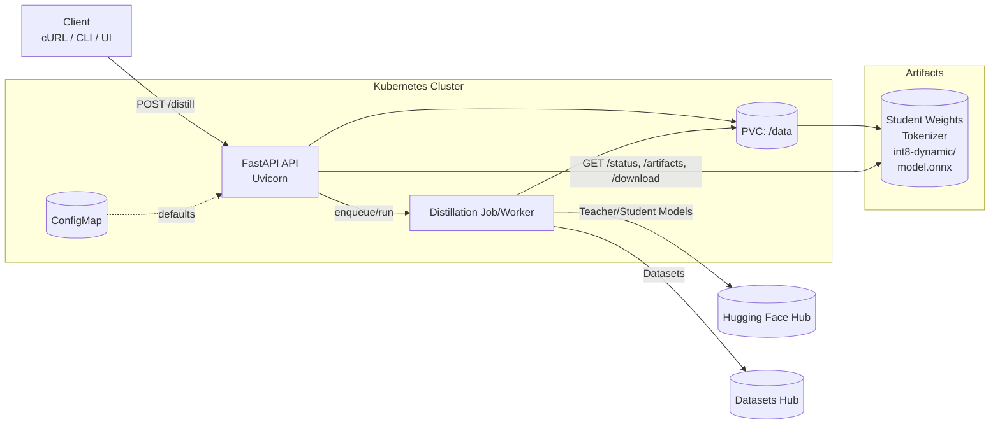

# LLM→SLM Distillation Microservice (Kubernetes‑ready)

Shrink a Large Language Model (LLM, the **teacher**) into a Small Language Model (SLM, the **student**) using a hybrid knowledge‑distillation algorithm. This service exposes a REST API, writes artifacts to persistent storage, and ships with Kubernetes manifests for quick deployment.

> **Status:** Developer preview. Verified on Windows (Python 3.13) and Linux. GPU optional.

---

## Architecture



**Flow:**
1. Client calls `POST /distill` with teacher/student/dataset config.
2. API kicks off a distillation run (Job/Worker).  
3. Worker pulls models/datasets, trains student with KD losses.  
4. Artifacts (student weights, tokenizer, optional int8 + ONNX) are persisted to a PVC.  
5. Client fetches status & downloads artifacts via the API.

---

## Why LLM→SLM?

- **Latency & cost:** smaller models are faster and cheaper to serve.
- **Edge & offline:** deploy on constrained hardware.
- **Domain refresh:** frequently update a compact student from an evolving teacher.

---

## Key Features

- **Hybrid KD loss** — temperature‑scaled KL (soft targets) + CE (hard pseudo‑labels) + hidden‑state MSE + cosine alignment; optional attention‑map MSE.  
- **Parameter‑efficient finetuning** — optional **LoRA** on the student.  
- **Quantization & export** — post‑training dynamic INT8 and **ONNX** export (best‑effort).  
- **Kubernetes‑ready** — PVC, ConfigMap, Deployment/Service for API, and a one‑off Job.  
- **Hugging Face ecosystem** — Transformers/Datasets/Accelerate/PEFT.

---

## Quickstart (Local)

```bash
python -m venv .venv && source .venv/bin/activate
pip install --upgrade pip
pip install -r requirements.txt

# Windows: set a writeable artifacts directory
# PowerShell
mkdir data
$env:DATA_DIR = "$PWD/data"

uvicorn app:api --host 0.0.0.0 --port 8000 --reload
```

Submit a tiny demo job:
```bash
curl -X POST http://localhost:8000/distill -H "Content-Type: application/json" -d '{
  "teacher_model": "gpt2",
  "student_model": "distilgpt2",
  "dataset": "wikitext",
  "subset": "wikitext-2-raw-v1",
  "max_steps": 30,
  "per_device_batch_size": 2,
  "grad_accum_steps": 4,
  "logging_steps": 5,
  "save_every": 30,
  "temperature": 2.0
}'
```

List/download artifacts:
```bash
curl http://localhost:8000/artifacts/<job_id>
curl -L "http://localhost:8000/download/<job_id>/config.json" -o config.json
```

---

## Kubernetes (Demo)

```bash
# 1) Build & push
docker build -t <your-registry>/llm2slm:latest .
docker push <your-registry>/llm2slm:latest

# 2) Storage + defaults
kubectl apply -f k8s/pvc.yaml
kubectl apply -f k8s/config.yaml

# 3) API (edit image in k8s/api-deployment.yaml)
kubectl apply -f k8s/api-deployment.yaml
kubectl apply -f k8s/api-service.yaml

# 4) One-off distillation Job (edit image in k8s/distill-job.yaml)
kubectl apply -f k8s/distill-job.yaml

# 5) Port-forward API
kubectl port-forward svc/llm2slm-api 8080:80
# POST to http://localhost:8080/distill
```

**GPU:** add resource requests/limits and the NVIDIA device plugin; the code auto‑uses CUDA if available.

---

## API

- `POST /distill` — start a distillation job (payload mirrors `schemas.DistillConfig`).  
- `GET /status/{job_id}` — return current/completed job status.  
- `GET /artifacts/{job_id}` — list generated files in the job folder.  
- `GET /download/{job_id}/{path}` — download any artifact.

**Example payload** (abridged):

```json
{
  "teacher_model": "gpt2",
  "student_model": "distilgpt2",
  "dataset": "wikitext",
  "subset": "wikitext-2-raw-v1",
  "split": "train",
  "max_steps": 200,
  "per_device_batch_size": 2,
  "grad_accum_steps": 8,
  "temperature": 2.0,
  "alpha_kl": 0.7,
  "beta_ce": 0.3,
  "gamma_mse": 0.05,
  "delta_cos": 0.05,
  "epsilon_attn": 0.0,
  "lora_r": 8,
  "lora_alpha": 16,
  "lora_dropout": 0.05,
  "use_qat": false,
  "post_training_quant": true,
  "export_onnx": true
}
```

---

## Algorithm (High‑Level)

### 1) Token-level KD (soft targets)
For sequence tokens $t=1,\dots,L-1$ (causal shift), with teacher/student logits $z_t^{(T)}, z_t^{(S)} \in \mathbb{R}^{V}$ and temperature $T>0$:

$$ \mathcal{L} = \alpha\, \mathcal{L}_{\mathrm{KD}} + \beta\, \mathcal{L}_{\mathrm{CE}} + \gamma\, \mathcal{L}_{\mathrm{MSE}} + \delta\, \mathcal{L}_{\cos} + \varepsilon\, \mathcal{L}_{\mathrm{Attn}}. $$

The factor $T^2$ preserves gradient scale under temperature smoothing.

### 2) Hard pseudo-labels (teacher argmax)
Let $\hat{y}t=\arg\max{v} z_{t,v}^{(T)}$ (no temperature):

$$ \mathcal{L} = \alpha\, \mathcal{L}_{\mathrm{KD}} + \beta\, \mathcal{L}_{\mathrm{CE}} + \gamma\, \mathcal{L}_{\mathrm{MSE}} + \delta\, \mathcal{L}_{\cos} + \varepsilon\, \mathcal{L}_{\mathrm{Attn}}. $$

### 3) Hidden-state alignment

Let $h_t^{(T)}, h_t^{(S)} \in \mathbb{R}^{d}$ be last-layer hidden states:

$$ \mathcal{L} = \alpha\, \mathcal{L}_{\mathrm{KD}} + \beta\, \mathcal{L}_{\mathrm{CE}} + \gamma\, \mathcal{L}_{\mathrm{MSE}} + \delta\, \mathcal{L}_{\cos} + \varepsilon\, \mathcal{L}_{\mathrm{Attn}}. $$

### 4) Attention-map alignment (optional)
For last-layer attention tensors $A^{(S)}, A^{(T)} \in \mathbb{R}^{H \times L \times L}$:

$$ \mathcal{L} = \alpha\, \mathcal{L}_{\mathrm{KD}} + \beta\, \mathcal{L}_{\mathrm{CE}} + \gamma\, \mathcal{L}_{\mathrm{MSE}} + \delta\, \mathcal{L}_{\cos} + \varepsilon\, \mathcal{L}_{\mathrm{Attn}}. $$

**Causal shift.** For auto-regressive LM, losses use $(\text{logits at }t)$ vs $(\text{label }x_{t+1})$. We implement this by slicing logits $[,:!,0{:}L{-}1]$ and labels $[,:!,1{:}L]$.

**LoRA (optional).** We fine-tune a low-rank adapter on the student; all losses backprop into LoRA parameters (and full weights if enabled).

### Symbols
- $N$: total token count across batch after causal shift.
- $V$: vocab size; $d$: hidden size; $H$: attention heads; $L$: sequence len.
- $\alpha,\beta,\gamma,\delta,\varepsilon \ge 0$: loss weights; $T$: temperature.

### Typical defaults

$$ T{=}2.0,\quad \alpha{=}0.7,\;\beta{=}0.3,\;\gamma{=}0.05,\;\delta{=}0.05,\;\varepsilon{=}0.0. $$

### Pseudocode (per step)
```python
# x: input ids, attn_mask: mask
with torch.no_grad():
    t = teacher(x, attention_mask=attn_mask,
                output_hidden_states=True, output_attentions=True)

s = student(x, attention_mask=attn_mask,
            output_hidden_states=True, output_attentions=True)

# Causal shift
logits_s = s.logits[:, :-1, :]
logits_t = t.logits[:, :-1, :]
labels    = x[:, 1:]

# KD (soft)
logp_sT = (logits_s / T).log_softmax(-1)
p_tT    = (logits_t / T).softmax(-1)
L_kd    = kl_div(logp_sT, p_tT, reduction="batchmean") * (T * T)

# CE (hard teacher argmax)
yhat = logits_t.argmax(-1)
L_ce = F.cross_entropy(logits_s.reshape(-1, V), yhat.reshape(-1))

# Hidden alignment
h_s, h_t = s.hidden_states[-1], t.hidden_states[-1]
L_mse = F.mse_loss(h_s, h_t)
L_cos = 1.0 - F.cosine_similarity(h_s, h_t, dim=-1).mean()

# Attention (optional)
L_attn = 0.0
if s.attentions and t.attentions:
    L_attn = F.mse_loss(s.attentions[-1], t.attentions[-1])

loss = α*L_kd + β*L_ce + γ*L_mse + δ*L_cos + ε*L_attn
loss.backward()
optimizer.step(); scheduler.step(); optimizer.zero_grad()
```

---

## Known Good Dependency Set

Works on Windows (Python 3.13) and Linux:
```
fastapi==0.115.0
uvicorn[standard]==0.30.6
pydantic==2.9.2
transformers>=4.45,<4.47
tokenizers>=0.20.1
datasets==3.0.1
accelerate==0.34.2
peft==0.13.2
torch>=2.2.0
onnx>=1.17.0
onnxruntime==1.23.0
numpy>=2.0
```

---

## References

1. Hinton, G., Vinyals, O., & Dean, J. (2015). *Distilling the Knowledge in a Neural Network.* arXiv:1503.02531. <https://arxiv.org/abs/1503.02531>  
2. Sanh, V., Debut, L., Chaumond, J., & Wolf, T. (2019). *DistilBERT: a distilled version of BERT.* arXiv:1910.01108. <https://arxiv.org/abs/1910.01108>  
3. Jiao, X. et al. (2020). *TinyBERT: Distilling BERT for Natural Language Understanding.* arXiv:1909.10351. <https://arxiv.org/abs/1909.10351>  
4. Romero, A. et al. (2015). *FitNets: Hints for Thin Deep Nets.* arXiv:1412.6550. <https://arxiv.org/abs/1412.6550>  
5. Hu, E. J. et al. (2021). *LoRA: Low-Rank Adaptation of Large Language Models.* arXiv:2106.09685. <https://arxiv.org/abs/2106.09685>  
6. Jacob, B. et al. (2018). *Quantization and Training of Neural Networks for Efficient Integer-Arithmetic-Only Inference.* CVPR. arXiv:1712.05877. <https://arxiv.org/abs/1712.05877>  
7. ONNX – Open Neural Network Exchange. <https://onnx.ai/>  
8. ONNX Runtime Documentation. <https://onnxruntime.ai/docs/>  
9. Hugging Face Transformers Docs. <https://huggingface.co/docs/transformers>  
10. Hugging Face Datasets Docs. <https://huggingface.co/docs/datasets>  
11. Hugging Face PEFT Docs. <https://huggingface.co/docs/peft>  
12. Hugging Face Accelerate Docs. <https://huggingface.co/docs/accelerate>  
13. PyTorch Documentation. <https://pytorch.org/docs/stable/>  
14. Vaswani, A. et al. (2017). *Attention Is All You Need.* NeurIPS. <https://arxiv.org/abs/1706.03762>

---
---

## Author

**Freeman Augustus Jackson**  
Maintainer & original author. For collaboration or questions, please open an issue in the repo (https://github.com/4th/llm2slm) or reach out via GitHub.

---

## Cite this project

If you use this software in your research or products, please cite it.

**Plain text**  
Jackson, Freeman Augustus. *LLM→SLM Distillation Microservice*. Version 0.1.0. 2025. https://github.com/4th/llm2slm.

**BibTeX**
```bibtex
@software{jackson_llm2slm_2025,
  author  = {Jackson, Freeman Augustus},
  title   = {LLM→SLM Distillation Microservice},
  year    = {2025},
  version = {0.1.0},
  url     = {https://github.com/4th/llm2slm},
  license = {Apache-2.0}
}
```

## License

Apache‑2.0 (or your preferred license).
